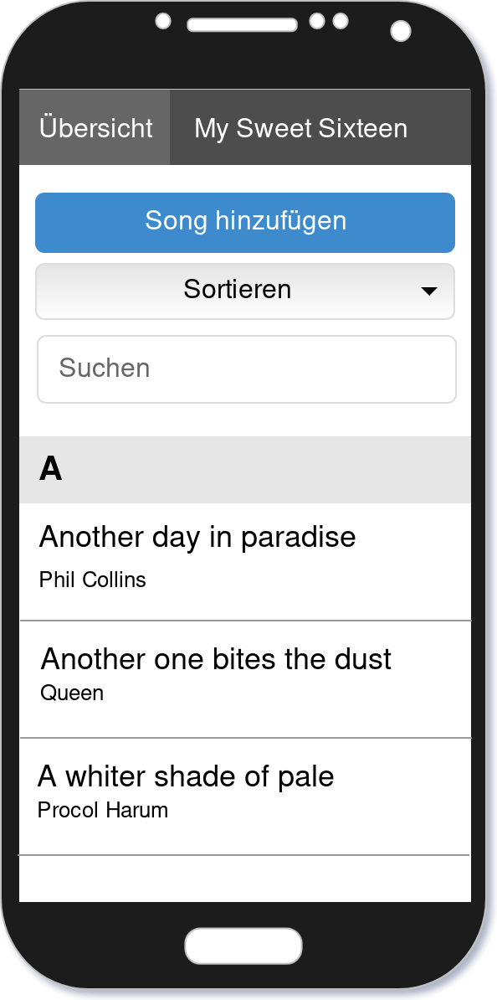

Webanwendung "WebFitness"
===============================

Kurzbeschreibung
----------------

Das ist eine Browser App, die mit einer Datenbank im Browser läuft. Es handelt sich dabei
um eine so genannte Single Page App, da die App nur einmal durch
Aufrufen der HTML-Datei gestartet und dann bis zum Verlassen der
App nicht wieder neugeladen wird.

Verwendete Technologien
-----------------------

Die App nutzt den Node Package Manager npm als Paketverwaltung. Auf diese
Weise werden der Application Bundler ParcelJS sowie eine Hand voll externe
Bibliotheken für die Anwendung installiert. Jedoch wird kein übergreifendes
Framework wie Angular oder React verwendet, da diese für eine allgemeine
Einführung zu speziell sind und viele wesentliche Details verbergen.

Folgende Entwicklungswerkzeuge kommen stattdessen zum Einsatz:

 * [git:](https://sourceforge.net/projects/gitextensions/") Versionsverwaltung zur gemeinsamen Arbeit am Quellcode
 * [npm:](https://nodejs.org/") Paketverwaltung zum automatischen Download abhängiger Bibliotheken
 * [Parcel:](https://parceljs.org/") Web Application Bundler und Entwicklungsserver

Zusätzlich werden folgende Bibliotheken genutzt:

 * [Navigo:](https://github.com/krasimir/navigo) Single Page Router zur Vereinfachung der Navigation innerhalb der App
 * [ChartJs:](https://www.chartjs.org/) ChartJs zum Anzeigen von den gespeicherten Daten

UI-Skizzen und Screenshots
--------------------------

Die App richtet sich an Sportler, die anhand von wenigen Daten ihre Maximalkraft eines bestimmten Muskels,
ihren BMI- oder Kalorienwert. Dabei werden die eingegebenen Daten pro Nutzer abgespeichert, sodass keine anderen
diese Daten einsehen können. 

<table style="max-width: 100%;">
    <tr>
        <td>
            
        </td>
        <td>
            
        </td>
        <td>
            
        </td>
    </tr>
    <tr>
        <td>
            Mobile Darstellung
        </td>
        <td>
            Übersicht der Songtexte
        </td>
        <td>
            Anzeige eines Songtexts
        </td>
    </tr>
</table>

Copyright
---------

Dieses Projekt ist lizenziert unter
[_Creative Commons Namensnennung 4.0 International_](http://creativecommons.org/licenses/by/4.0/)

© 2019 - WWI18B3 - Sascha Klevenhaus, Hannah Bjork, Abishek Anthony
