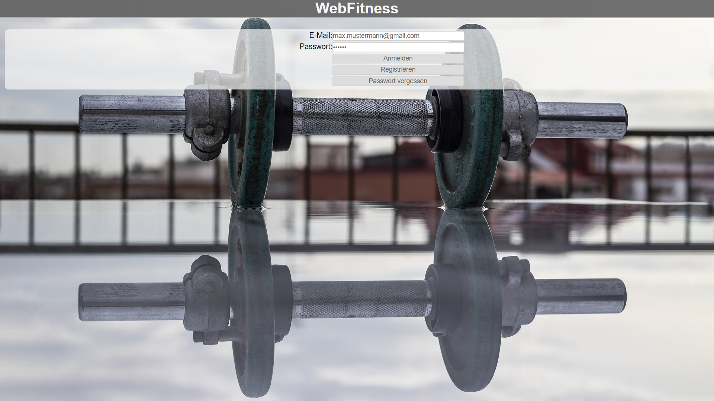
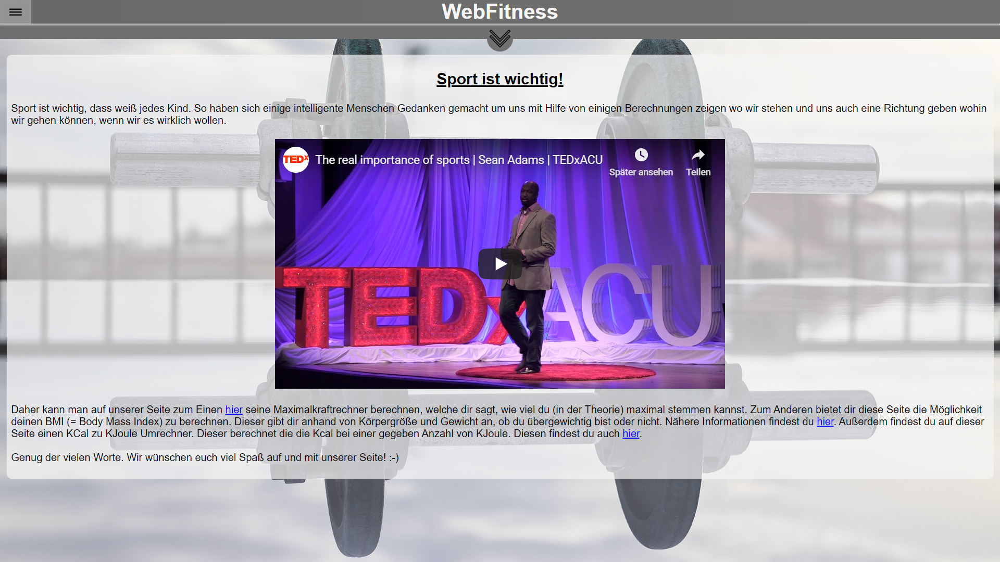

Webanwendung "WebFitness"
===============================

Kurzbeschreibung
----------------

Das ist eine Browser App, die mit einer Datenbank im Browser läuft. Es handelt sich dabei
um eine so genannte Single Page App, da die App nur einmal durch
Aufrufen der HTML-Datei gestartet und dann bis zum Verlassen der
App nicht wieder neugeladen wird.

Verwendete Technologien
-----------------------

Die App nutzt den Node Package Manager npm als Paketverwaltung. Auf diese
Weise werden der Application Bundler ParcelJS sowie eine Hand voll externe
Bibliotheken für die Anwendung installiert. Jedoch wird kein übergreifendes
Framework wie Angular oder React verwendet, da diese für eine allgemeine
Einführung zu speziell sind und viele wesentliche Details verbergen.

Folgende Entwicklungswerkzeuge kommen stattdessen zum Einsatz:

 * [git:](https://sourceforge.net/projects/gitextensions/") Versionsverwaltung zur gemeinsamen Arbeit am Quellcode
 * [npm:](https://nodejs.org/") Paketverwaltung zum automatischen Download abhängiger Bibliotheken
 * [Parcel:](https://parceljs.org/") Web Application Bundler und Entwicklungsserver

Zusätzlich werden folgende Bibliotheken genutzt:

 * [Navigo:](https://github.com/krasimir/navigo) Single Page Router zur Vereinfachung der Navigation innerhalb der App
 * [ChartJs:](https://www.chartjs.org/) ChartJs zum Anzeigen von den gespeicherten Daten

UI-Skizzen und Screenshots
--------------------------

Die App richtet sich an Sportler, die anhand von wenigen Daten ihre Maximalkraft eines bestimmten Muskels,
ihren BMI- oder Kalorienwert. Dabei werden die eingegebenen Daten pro Nutzer abgespeichert, sodass keine anderen
diese Daten einsehen können.  
               
             Anmeldeseite -   
                       <ol> 
                            <li>Geben Sie ihre E-Mail-Adresse und das dazugehörige Passwort ein in den jeweiligen Eingabefeldern ein. 
                                <ol> 
                                    <li>Falls Sie noch nicht registriert sind, klicken Sie auf den Button „Registrieren“.</li>
                                    <li>Wenn das Eingabefeld „Email“ invalide ist, wird dieser rot umrandet</li>
                                <li>Wenn das Eingabefeld „Passwort“ invalide ist, wird dieser rot umrandet</li>
                                </ol>
                            </li>
                            <li>Führen Sie die Anweisung „3.“ erneut aus 
                                <ol>
                                    <li>Wenn das Eingabefeld „Passwort“ leer ist, wird ein Error (-Icon) rechts am Bildschirm im Eingabefeld „Passwort darf nicht leer sein!“ angezeigt.</li>
                                </ol>
                            </li>
                            <li>Führen Sie die Anweisung „3.“ erneut aus  
                                <ol>
                                    <li>Es erscheint ein Dialog in dem Sie aufgefordert werden das Passwort erneut einzugeben.</li>
                                    <li>Geben Sie Ihr Passwort erneut ein.</li>
                                </ol>
                             <li>Wenn das Passwort nicht übereinstimmt, wird ein Error (-Icon) in der Ansicht wie in „2.“ beschrieben rechts am Bildschirm im Eingabefeld „Passwort“ mit der Nachricht „Die Passwörter stimmen nicht überein!“ angezeigt.</li>
                       <li>Klicken Sie auf den Button "Registrieren"</li>
                       <li>Führen Sie die Anweisung "3.b" erneut aus.</li>
                       <li>Bestätigen Sie die von uns versendete E-Mail im Postfach von der angegebene E-Mail-Adresse
                       <ol>
                       <li>Klicken Sie auf den Button "Anmelden"
                       <ol>
                       <li>Wenn das Eingabefeld "E-Mail" leer ist, wird ein Error angezeigt "E-Mail darf nicht leer sein!"</li>
                       </ol>
                       </li>
                       </ol>
                       </li> 
                       <li>Führen Sie die Anweisung "3" erneut aus.
                       <ol>
                       <li>Wenn die E-Mail-Adresse und das Passwort nicht übereinstimmen, werden rechts am Bildschrim bei beiden Eingabefelder ein Error mit der Nachricht "E-Mail oder Passwort falsch!" angezeigt.</li>
                       </ol>
                       </li>
                       <li>Geben Sie eine registrierte E-Mail-Adresse und das dazugehörige Passwort ein</li>
                       <li>Führen Sie die Anweisung "3.b" erneut aus </li>
                        
               
                        Übersicht der Startseite in der Desktopversion   
               
            Übersicht der Startseite in der Handyversion
     

Copyright
----------

Dieses Projekt ist lizenziert unter
[_Creative Commons Namensnennung 4.0 International_](http://creativecommons.org/licenses/by/4.0/)

© 2019 - WWI18B3 - Sascha Klevenhaus, Hannah Bjork, Abishek Anthony
