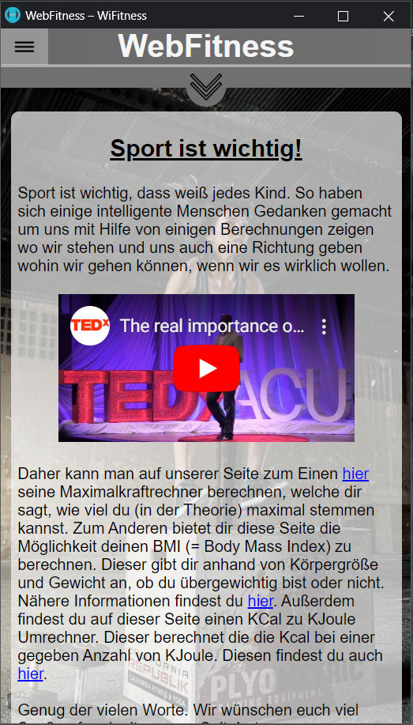

Webanwendung "WebFitness"
===============================

Kurzbeschreibung
----------------

Das ist eine Browser App, die mit einer externen Datenbank (Firebase) in jedem herkömmlichen Browser läuft. 
Es handelt sich dabei um eine so genannte Single Page App, da diese App nur einmal durch
Aufrufen der HTML-Datei gestartet und dann bis zum Verlassen der
App nicht wieder neugeladen wird.

Verwendete Technologien
-----------------------

Die App nutzt den Node Package Manager npm als Paketverwaltung. Auf diese
Weise werden der Application Bundler ParcelJS, sowie eine Hand voll externe
Bibliotheken für die Anwendung installiert. Jedoch wird kein übergreifendes
Framework wie Angular oder React verwendet, da diese für eine allgemeine
Einführung zu speziell sind und viele wesentliche Details verbergen.

Folgende Entwicklungswerkzeuge kommen stattdessen zum Einsatz:

 * [MobileBrowser Emulator:](https://chrome.google.com/webstore/detail/mobile-browser-emulator/lbofcampnkjmiomohpbaihdcbjhbfepf?hl=de) Google Chrome Addon: Emulator zum Simulieren von mobilen Endgeräten 
 * [git:](https://sourceforge.net/projects/gitextensions/") Versionsverwaltung zur gemeinsamen Arbeit am Quellcode
 * [npm:](https://nodejs.org/") Paketverwaltung zum automatischen Download abhängiger Bibliotheken
 * [Parcel:](https://parceljs.org/") Web Application Bundler und Entwicklungsserver

Zusätzlich werden folgende Bibliotheken genutzt:

 * [Navigo:](https://github.com/krasimir/navigo) Single Page Router zur Vereinfachung der Navigation innerhalb der App
 * [ChartJs:](https://www.chartjs.org/) ChartJs zum Anzeigen von den gespeicherten Daten

UI-Skizzen und Screenshots
--------------------------

Die App richtet sich an Sportler, die anhand von wenigen Daten ihre Maximalkraft eines bestimmten Muskels,
ihren BMI- und/oder Kalorienwert berechnen wollen. Dabei werden die eingegebenen Daten pro Nutzer abgespeichert, sodass keine anderen Nutzer
diese Daten einsehen können. Sie können über den Menüpfeil in der Mitte der Seite oder über die "hier"-Verlinkung im Text zu den verschiedenen Seiten gelangen.
Der Menü-Button oben links in der Ecke gibt Ihnen die Möglichkeit sich auszuloggen, auf die einzelnen Instagram-Profile der Schöpfer dieser Seite zu kommen und sowie
ist dort das Impressum verlinkt.   
              
              
             Anmeldeseite 
             
              
                       <ol> 
                            <li>Geben Sie ihre E-Mail-Adresse und das dazugehörige Passwort in den jeweiligen Eingabefeldern ein.
                                <ol> 
                                    <li>Falls Sie noch nicht registriert sind, klicken Sie auf den Button „Registrieren“. 
                                        <ol>                               
                                          <li>Wenn das Eingabefeld „E-Mail“ invalide ist, wird dieses rot umrandet.
                                                <ol>
                                                    <li>Führen Sie die Anweisung „1.“ erneut aus.</li>
                                                </ol>
                                          </li>
                                          <li>Wenn das Eingabefeld „Passwort“ invalide ist, wird dieses rot umrandet.
                                                <ol>
                                                    <li>Führen Sie die Anweisung „1.“ erneut aus.</li>
                                                </ol>
                                          </li>
                                          <li>Bestätigen Sie die von uns versendete E-Mail.</li>
                                        </ol>
                                    </li>
                                </ol>
                            </li>
                            <li>Klicken Sie auf den Button "Anmelden".
                                <ol>
                                   <li>Wenn das Eingabefeld "E-Mail" leer ist, wird das Feld rot umrandet.
                                      <ol>
                                        <li>Führen Sie die Anweisung "2" erneut aus.</li>
                                      </ol>
                                   </li>
                                   <li>Wenn die E-Mail-Adresse und das Passwort nicht übereinstimmen, wird oben am Bildschrim eine Warnung mit der Nachricht "Ungültiges Passwort und/oder falsche E-Mail Adresse. Zugriff verweigert!" angezeigt.
                                      <ol>
                                        <li>Geben Sie eine registrierte E-Mail-Adresse und das dazugehörige Passwort ein.</li>
                                        <li>Führen Sie die Anweisung "2" erneut aus.</li>
                                      </ol>
                                   </li>
                                   <li>Wenn Sie Ihr Passwort vergessen haben sollten, tragen Sie Ihre E-Mail Adresse im Feld "E-Mail" ein und drücken Sie den Button "Passwort vergessen". Sie bekommen hierdurch eine E-Mail von Firebase zugesendet.
                                        <ol>
                                            <li>Gehen Sie auf den von uns gesendeten Link.</li>
                                            <li>Folgen Sie den Anweisungen zum Ändern Ihres Passwortes.</li>
                                            <li>Führen Sie die Anweisung "2." erneut aus.</li>
                                       </ol>
                                   </li>
                                </ol>
                            </li>
                       </ol>
                        
                       Übersicht der Startseite in der Desktopversion
             
                        
                        
                        Übersicht der Startseite in der Handyversion
            
            
     

Copyright
----------

Dieses Projekt ist lizenziert unter
[_Creative Commons Namensnennung 4.0 International_](http://creativecommons.org/licenses/by/4.0/)

© 2019 - WWI18B3 - Abishek Anthony, Hannah Bjork, Sascha Klevenhaus